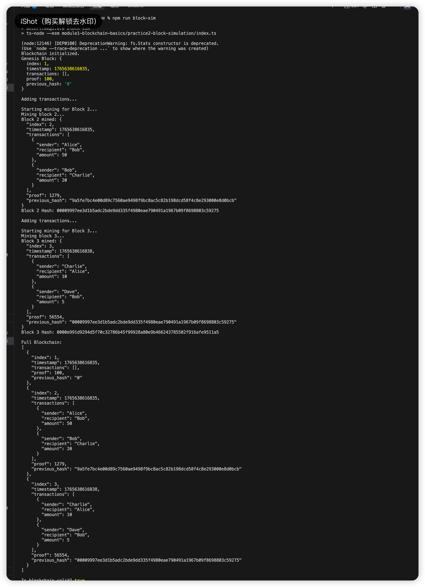

# 最小区块链模拟 (Minimal Blockchain Simulation)

本项目使用 TypeScript 实现了一个最小化的区块链，演示了以下核心功能：
1. **工作量证明 (PoW)**: 挖矿难度设定为哈希值必须以 4 个 `0` (`0000`) 开头。
2. **链式结构**: 区块通过 `previous_hash` 相互连接，确保数据不可篡改。

## 目录结构

```text
module1-blockchain-basics/practice2-block-simulation/
├── blockchain.ts    # 区块链类及区块结构定义
├── index.ts         # 模拟脚本：执行挖矿及验证链
└── README.md        # 说明文档
```

## 如何运行

确保已安装 `ts-node`，或直接使用 `npm` 运行（如下所示）。

```bash
# 进入项目根目录
cd /Users/wesley/workspace/DeCert.me

# 运行模拟脚本
npm run block-sim
```

## 运行日志示例

下方是模拟运行的输出示例：

```json
Blockchain initialized.
Genesis Block: {
  "index": 1,
  "timestamp": 1734098227000,
  "transactions": [],
  "proof": 100,
  "previous_hash": "0"
}

Adding transactions...

Starting mining for Block 2...
Mining block 2...
Block 2 mined: {
  "index": 2,
  "timestamp": 1734098227123,
  "transactions": [
    {
      "sender": "Alice",
      "recipient": "Bob",
      "amount": 50
    },
    {
      "sender": "Bob",
      "recipient": "Charlie",
      "amount": 20
    }
  ],
  "proof": 78352,
  "previous_hash": "65c500039ee10bd90a2a5ba015013e928b9a714e1a98f0e46d4ed45d02b130a1"
}
Block 2 Hash: 0000b253797f01e56f45d56ae4400e8b3bba74c4fc95b8a2511bbbcb8b6bd6a8

Adding transactions...

Starting mining for Block 3...
Mining block 3...
Block 3 mined: {
  "index": 3,
  "timestamp": 1734098227567,
  "transactions": [
    {
      "sender": "Charlie",
      "recipient": "Alice",
      "amount": 10
    },
    {
      "sender": "Dave",
      "recipient": "Bob",
      "amount": 5
    }
  ],
  "proof": 5592,
  "previous_hash": "0000b253797f01e56f45d56ae4400e8b3bba74c4fc95b8a2511bbbcb8b6bd6a8"
}
Block 3 Hash: 00009185460a652731d3afbec426b895d3cf1f5760a3415c98951a82ccb9c257

Full Blockchain:
[
  ... (完整链数据)
]

Is blockchain valid? true
```

## 实现细节

- **区块结构 (Block)**:
    - `index`: 区块高度（索引）。
    - `timestamp`: 区块创建时间戳。
    - `transactions`: 交易列表。
    - `proof`: 通过 PoW 找到的 nonce 值。
    - `previous_hash`: 前一个区块的哈希值。
- **PoW (挖矿)**: `mine()` 方法通过不断递增 `proof` 计数器，直到计算出的区块哈希值（包含索引、时间戳、数据、前驱哈希、proof）以 `0000` 开头。

## 截图

